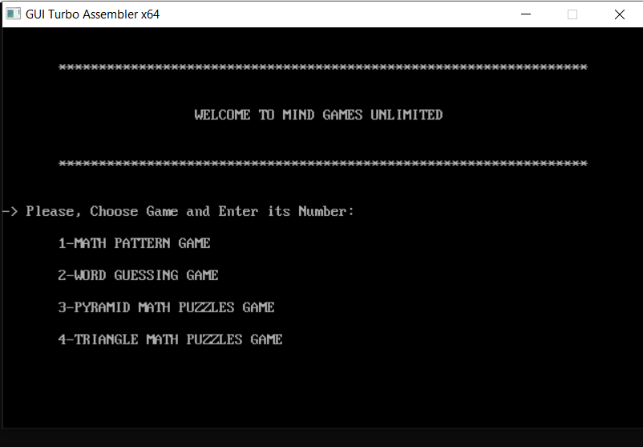

# Mind Games Unlimited

## Description
Mind Games Unlimited is a collection of different puzzles and mind games that help you think, focus, and strengthen your logical and reasoning skills.

## The project is in Assembly Language and includes 4 Games:
  - Math Pattern Game
  - Word Guessing Game
  - Pyramid Math Puzzles Game
  - Triangle Math Puzzles Game

## Contributors
- Amira Deaf: [GitHub Profile](https://github.com/AmiraDeef)
- Mai Elkhodery: [GitHub Profile](https://github.com/maielkhodery)
- Eman Elhelaly: [GitHub Profile](https://github.com/EmanElhelaly11)

## Explanation video: [Link](https://youtu.be/JELeX1ift40?si=bGSgYDcw_gB375e2)
 

